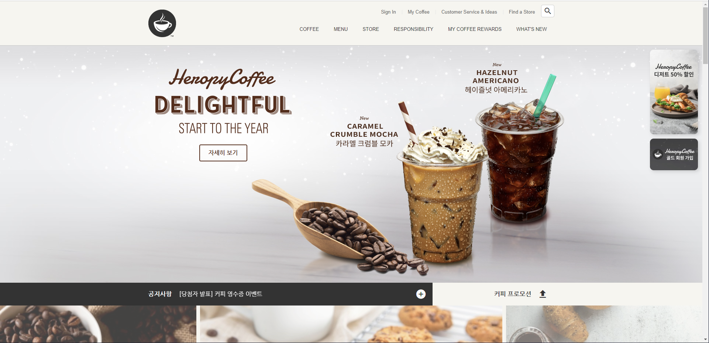

# ☕ COFFEE

js 연습<br>
카페 랜딩 페이지(홈페이지)를 만드는 실습

[DEMO]()
[DEMO/Signin]()



## 문자 인코딩 설정

```html
<meta charset="UTF-8">
```
-`UTF-8`: 초성, 중성, 종성으로 구분하여 문자를 작성<br>
-`EUC-KR`: 하나의 완성된 글자를 인식

## 뷰포트 렌더링 방식 설정

웹페이지 화면에 표현되는 방식을 설정합니다.<br>
모바일 환경에서도 적용됩니다.

```html
<meta name="viewport" content="width=device-width, initial-scale=1.0">
```

- `width=device-width`: 화면의 가로 너비를 각 디바이스(Device)의 가로 너비와 동일하게 적용
- `initial-scale=1.0`: 화면의 초기 화면 배율(확대 정도)을 설정
- `user-scalable=no`: 사용자가 디바이스 화면을 확대(`yes`)/축소(`no`)할 수 있는지 설정
- `maximum-scale=1`: 사용자가 화면을 확대할 수 있는 최댓값
- `minimum-scale=1`: 사용자가 화면을 축소할 수 있는 최솟값

## 파비콘(Favicon)

웹페이지의 로고를 설정합니다<br>
대부분의 경우 루트 경로에 `favicon.ico` 파일을 위치하기 때문에 `<link />` 를 작성할 필요가 없습니다.<br>
`favicon.png` 파일을 사용한다면 다음과 같이 `<link />`를 작성합니다.

```html
<link rel="icon" href="./favicon.png" />
```

  


## .ico 파일 제작

[iconifier.net](https://iconifier.net)

## Reset.css

각 브라우저의 기본 스타일을 초기화합니다.

```html
<link rel="stylesheet" href="https://cdn.jsdelivr.net/npm/reset-css@5.0.1/reset.min.css" />
```

## 오픈 그래프

웹페이지가 소셜 미디어(페이스북 등)로 공유될 때 우선적으로 활용되는 정보를 지정합니다.

[오픈 그래프 속성 보기](https://ogp.me/)

## 트위터 카드

웹페이지가 소셜 미디어(트위터)로 공유될 때 우선적으로 활용되는 정보를 지정합니다.

[트위터 카드 보기](https://developer.twitter.com/en/docs/twitter-for-websites/cards/guides/getting-started)

## Google Fonts

이벤에 사용할 '나눔고딕' 폰트를 지정합니다.

[Google Fonts](https://fonts.google.com/)

```html
<link rel="preconnect" href="https://fonts.googleapis.com" />
<link rel="preconnect" href="https://fonts.gstatic.com" crossorigin />
<link href="https://fonts.googleapis.com/css2?family=Nanum+Gothic:wght@400;700&display=swap" rel="stylesheet" />
```

css 글자/문자 관련 속성은 상속됩니다.

```css
body {
    font-family: 'Nanum Gothic', sans-serif;
}
```

## Google Material Icons

[Material Icons](https://material.io/resources/icons/?style=baseline) 구글에서 무료로 제공해 주는 것을 사용합니다.

[Getting started for web](https://material.io/develop/web/getting-started)

```html
<link rel="stylesheet" href="https://fonts.googleapis.com/icon?family=Material+Icons" />
```

다음과 같이 사용합니다.

```html
<div class="material-icons">upload</div>
```

## GSAP & ScrollToPlugin

[GSAP](https://greensock.com/gsap/)은 자바스크립트로 제어하는 타임라인 기반의 애니메이션 라이브러리입니다.<br>
[ScrollToPlugin](https://greensock.com/scrolltoplugin/)은 스크롤 애니메이션을 지원하는 GSAP 플러그인입니다.

```html
<script src="https://cdnjs.cloudflare.com/ajax/libs/gsap/3.9.1/gsap.min.js" integrity="sha512-H6cPm97FAsgIKmlBA4s774vqoN24V5gSQL4yBTDOY2su2DeXZVhQPxFK4P6GPdnZqM9fg1G3cMv5wD7e6cFLZQ==" crossorigin="anonymous" referrerpolicy="no-referrer"></script>
<script src="https://cdnjs.cloudflare.com/ajax/libs/gsap/3.9.1/ScrollToPlugin.min.js" integrity="sha512-agNfXmEo6F+qcj3WGryaRvl9X9wLMQORbTt5ACS9YVqzKDMzhRxY+xjgO45HCLm61OwHWR1Oblp4QSw/SGh9SA==" crossorigin="anonymous" referrerpolicy="no-referrer"></script>
```

[.to() 사용법](https://greensock.com/docs/v3/GSAP/gsap.to())  
[GSAP Easing](https://greensock.com/docs/v3/Eases)

```js
gsap.to(요소, 시간, 옵션)
```

## Swiper

[Swiper](https://swiperjs.com/)는 하드웨어 가속 전환과 여러 기본 동작을 갖춘 슬라이드 라이브러리입니다.

[Getting Started With Swiper](https://swiperjs.com/get-started)

```html
<!-- in HEAD -->
<link rel="stylesheet" href="https://unpkg.com/swiper@7/swiper-bundle.min.css" />
<script src="https://unpkg.com/swiper@7/swiper-bundle.min.js"></script>

<!-- in BODY -->
<div class="swiper">
  <div class="swiper-wrapper">
    <div class="swiper-slide">1</div>
    <div class="swiper-slide">2</div>
    <div class="swiper-slide">3</div>
  </div>
</div>
```

[Swiper API](https://swiperjs.com/swiper-api)(옵션)을 확인하세요!

```js
new Swiper(요소, 옵션);
```

## Youtube API

[IFrame Player API](https://developers.google.com/youtube/iframe_api_reference?hl=ko)를 통해 YouTube 동영상을 제어할 수 있습니다.

유튜브 영상이 출력될 위치에 요소를 지정(생성)합니다.

```html
<!-- in HEAD -->
<script defer src="./js/youtube.js"></script>

<!-- in BODY -->
<div id="player"></div>
```

`onYouTubePlayerAPIReady` 함수 이름은 Youtube IFrame Player API에서 사용하는 이름이기 때문에 다르게 지정하면 동작하지 않습니다!<br>
그리고 함수는 전역 등록해야 합니다!

[플레이어 매개변수(playerVars)](https://developers.google.com/youtube/player_parameters.html?playerVersion=HTML5&hl=ko#Parameters)에서 더 많은 옵션을 확인할 수 있습니다.

```js
// Youtube IFrame API를 비동기로 로드합니다.
var tag = document.createElement('script');
tag.src = "https://www.youtube.com/iframe_api";
var firstScriptTag = document.getElementsByTagName('script')[0];
firstScriptTag.parentNode.insertBefore(tag, firstScriptTag);
function onYouTubeIframeAPIReady() {
  new YT.Player('player', {
    videoId: 'Tdwetb0Mvyc', // 최초 재생할 유튜브 영상 ID
    playerVars: {
      autoplay: true, // 자동 재생 유무
      loop: true, // 반복 재생 유무
      playlist: 'Tdwetb0Mvyc' // 반복 재생할 유튜브 영상 ID 목록
    },
    events: {
      // 영상이 준비되었을 때,
      onReady: function (event) {
        event.target.mute() // 음소거!
      }
    }
  });
}
```

## ScrollMagic

[ScrollMagic](https://github.com/janpaepke/ScrollMagic)은 스크롤과 요소의 상호 작용을 위한 자바스크립트 라이브러리입니다.<br>
대표적으로 어떤 요소가 현재 화면에 보이는 상태인지를 확인할 때 사용합니다.

[ScrollMagic API](http://scrollmagic.io/docs/)

```html
<script src="https://cdnjs.cloudflare.com/ajax/libs/ScrollMagic/2.0.8/ScrollMagic.min.js" integrity="sha512-8E3KZoPoZCD+1dgfqhPbejQBnQfBXe8FuwL4z/c8sTrgeDMFEnoyTlH3obB4/fV+6Sg0a0XF+L/6xS4Xx1fUEg==" crossorigin="anonymous" referrerpolicy="no-referrer"></script>
```
